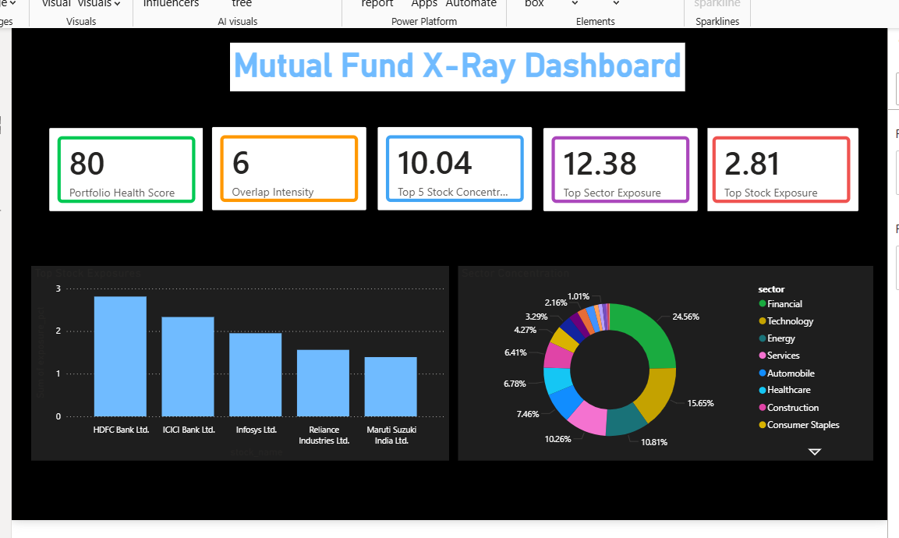

# Mutual Fund X-Ray Analyzer

## Project Overview

This project analyzes mutual fund portfolios using Python and Power BI.

It calculates:
- Portfolio Health Score
- Stock Exposure Analysis
- Sector Concentration
- Portfolio Overlap Intensity

The goal is to help investors understand diversification risk and portfolio concentration.


---

## Features

- Portfolio Health Scoring Engine
- Top Stock Exposure Analysis
- Sector Concentration Analysis
- Fund Overlap Detection
- Power BI Dashboard Visualization


---

## Tech Stack

- Python
- Pandas
- Power BI
- Git & GitHub


---

## Dashboard Preview




---

## Project Structure

```text
Mutual_Fund_XRay_Project/
│
├── raw/
├── cleaned/
├── scripts/
├── screenshots/


