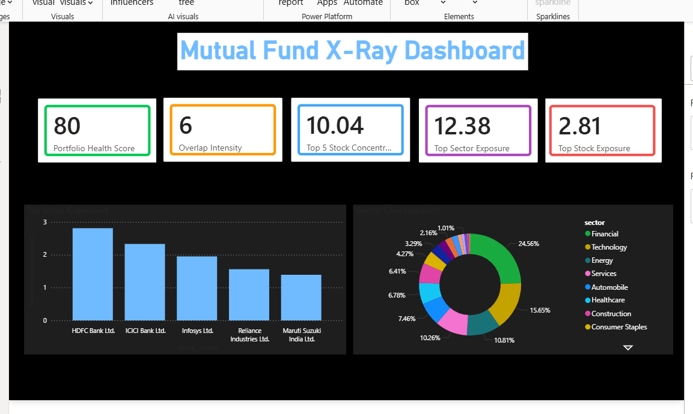

# Mutual Fund X-Ray Analyzer

> A portfolio intelligence system that dissects mutual fund holdings to reveal hidden concentration risks, stock overlaps, and sector imbalances — built with Python and Power BI.



---

## Overview

Most investors hold multiple mutual funds believing they're diversified — but often those funds hold the same top stocks. This project performs an **X-Ray analysis** of mutual fund portfolios using real fund data from Kaggle, revealing:

- Which stocks dominate your combined portfolio exposure
- Where funds silently overlap
- How concentrated your sector bets really are
- A composite **Portfolio Health Score** that flags risk at a glance

Built for investors, analysts, and anyone preparing for BFSI roles who wants a data-driven lens on portfolio quality.

---

## Features

| Module | Description |
|---|---|
| **Portfolio Health Scoring Engine** | Composite score (0–100) based on diversification, sector spread, and overlap intensity |
| **Top Stock Exposure Analysis** | Identifies which individual stocks have the highest combined weight across all held funds |
| **Sector Concentration Analysis** | Breaks down portfolio allocation by sector — flags over-concentration in any single theme |
| **Fund Overlap Detection** | Quantifies how many holdings are shared between two or more funds in the portfolio |
| **Power BI Dashboard** | Interactive visualizations with slicers for fund selection, sector filter, and overlap view |

---

## Tech Stack

- **Python** — data processing, scoring logic, overlap calculation
- **Pandas** — data cleaning, transformation, and aggregation
- **Power BI** — interactive dashboard and visual analytics
- **Git & GitHub** — version control

---

## Dataset

**Source:** Kaggle — Mutual Fund Portfolio Holdings Dataset

**Coverage:** Multiple Indian mutual funds across equity, debt, and hybrid categories

**Key data points used:**
- Fund name and category
- Stock/security name and ISIN
- Portfolio weight (%) per holding
- Sector classification

> Download the dataset from Kaggle and place the files in the `raw/` folder before running.

---

## How Portfolio Health Score Works

The health score is a composite metric calculated from three weighted signals:

| Signal | Weight | Logic |
|---|---|---|
| Diversification index | 40% | Higher score for funds with wider stock spread |
| Sector concentration | 35% | Penalizes heavy concentration in a single sector |
| Overlap intensity | 25% | Penalizes high holdings overlap across funds |

A score above 70 indicates a healthy, well-diversified portfolio. Below 50 flags significant concentration risk.

---

## Project Structure

```
Mutual-Fund-XRay-Analyzer/
│
├── raw/                    # Original dataset files from Kaggle
│   └── *.csv
│
├── cleaned/                # Processed and transformed data
│   └── *.csv
│
├── scripts/                # Python analysis scripts
│   └── *.py
│
├── screenshots/            # Dashboard preview images
│   └── dashboard.png
│
└── README.md
```

---

## Getting Started

### 1. Clone the repository

```bash
git clone https://github.com/saarthak19s/Mutual-Fund-XRay-Analyzer.git
cd Mutual-Fund-XRay-Analyzer
```

### 2. Install dependencies

```bash
pip install -r requirements.txt
```

### 3. Add the dataset

Download the mutual fund holdings dataset from Kaggle and place the CSV files in the `raw/` folder.

### 4. Run the analysis

```bash
python scripts/analyzer.py
```

This generates cleaned data files in `cleaned/` and prints the Portfolio Health Score summary.

### 5. Open the dashboard

Open the `.pbix` file in Power BI Desktop and connect it to the cleaned data folder.

---

## Requirements

```
pandas
numpy
```

> Python 3.8+ recommended. Power BI Desktop required for the dashboard (free download from Microsoft).

---

## Key Insights This System Delivers

- **Hidden overlap exposed** — two funds marketed as "diversified" can share 60–70% of their top 10 holdings
- **Sector bias detection** — a portfolio spread across 5 funds can still have 50%+ in financial services
- **Health score at a glance** — one number that summarises portfolio risk without reading 500 rows of data
- **Actionable flags** — the system tells you *which fund* is the main source of concentration risk

---

## Why This Project Matters for BFSI

Fund overlap and concentration risk are core concerns for wealth managers, portfolio analysts, and fintech platforms like Groww, Zerodha, and Paytm Money. This system replicates the kind of X-Ray analysis tools that platforms like Morningstar and Value Research offer — built from scratch using Python and Power BI.

---

## Dashboard Preview


---

## Author

**Saarthak** — [GitHub](https://github.com/saarthak19s)
